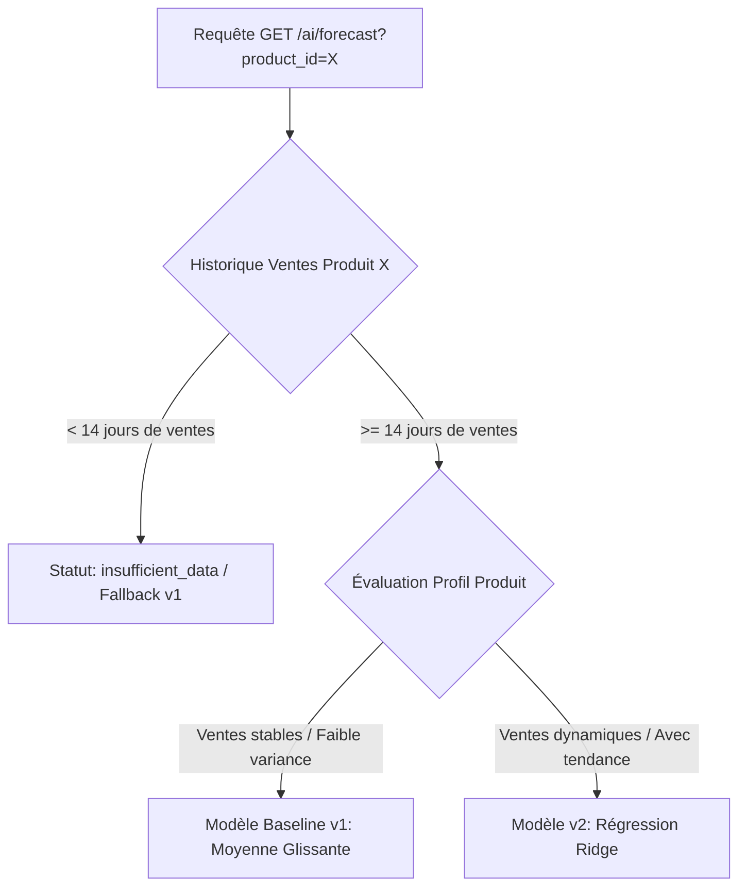

# Rapport d'Évaluation Out-of-Time : Modèle Baseline v1 vs Modèle Ridge v2 (Phase 4, Sprint 1)

**Date :** 14 août 2026  
**Périmètre :** Service IA (`ai-service`), comparaison quantitative du modèle baseline v1 (moyenne glissante) et du modèle v2 (régression linéaire régularisée Ridge avec 9 features temporelles et autoregressives).  
**Méthode de validation :** Split temporel strict out-of-time (découpage chronologique par produit, sans aucun tirage aléatoire).  
**Contrainte d'étape :** Évaluation pure. L'endpoint d'inférence `/forecast` n'a pas été modifié lors de cette tâche.

---

## 1. Méthodologie de Validation Out-of-Time

Afin de respecter la nature séquentielle et temporelle des données de ventes et d'éviter tout problème de fuite de données futures (*data leakage*), l'évaluation s'appuie sur une validation **out-of-time** stricte :

1. **Ordre Chronologique :** Pour chaque produit, les observations quotidiennes sont triées de manière séquentielle par `sale_date`.
2. **Découpage Temporel :**
   - **Jeu d'Entraînement (*Train Set* - Passé chronologique) :** Les 75% premières observations historiques (soit **25 lignes d'agrégats au total**).
   - **Jeu de Test (*Test Set* - Futur hors-échantillon) :** Les 25% les plus récents en fin de série (soit **8 lignes d'agrégats au total**).
3. **Isolation des Modèles :**
   - Le modèle **v2 (Ridge)** est ajusté uniquement sur le jeu d'entraînement.
   - La **baseline v1** s'appuie uniquement sur les moyennes calculées sur le passé (jeu d'entraînement).

---

## 2. Résultats d'Évaluation Globaux (Sur le Jeu de Test Temporel)

| Modèle IA | Type d'Algorithme | MAE (Erreur Absolue Moyenne) | RMSE (Erreur Quadratique Moyenne) | Écart MAE par rapport à v1 | Écart RMSE par rapport à v1 |
| :--- | :--- | :---: | :---: | :---: | :---: |
| **Baseline v1** | Moyenne Glissante Naïve (7j) | `2.9821` | `6.1006` | Ref. | Ref. |
| **Modèle v2** | Régression Ridge (`alpha=1.0`) + Scaler | **`2.7068`** | **`5.2716`** | **`-0.2753` (`+9.23%`)** | **`-0.8290` (`+13.59%`)** |

### Synthèse Globale :
Le nouveau modèle **v2 (Ridge Regression)** surpasse la baseline v1 sur l'ensemble du jeu de test hors-échantillon avec :
- Une réduction de **$9.23\%$ de l'erreur absolue moyenne (MAE)**.
- Une réduction de **$13.59\%$ de l'erreur quadratique moyenne (RMSE)** (meilleure atténuation des fortes erreurs).

---

## 3. Analyse Détaillée Produit par Produit

L'évaluation out-of-time a été décomposée pour chaque produit afin d'observer le comportement du modèle v2 face à la stabilité ou la variabilité des ventes.

| ID | Nom du Produit | Échantillons Train | Échantillons Test | MAE v1 (Baseline) | RMSE v1 (Baseline) | MAE v2 (Ridge) | RMSE v2 (Ridge) | Modèle le Plus Performant |
| :---: | :--- | :---: | :---: | :---: | :---: | :---: | :---: | :---: |
| **25** | `Croissant Pur Beurre` | 13 | 4 | `5.2500` | `8.5878` | **`4.3092`** | **`7.3466`** | **`v2 (Ridge Regression)`** |
| **30** | `kak warka` | 12 | 4 | **`0.7143`** | **`0.8268`** | `1.1044` | `1.2673` | **`v1 (Baseline)`** |

### Interprétation Honnête des Résultats :

1. **Produit 25 (`Croissant Pur Beurre`) — Victoire de v2 :**
   - **Ventes variables et en hausse** (pics de vente jusqu'à 20 unités).
   - La baseline v1 plafonne à une constante naïve de 3.0 unités ($MAE = 5.25$).
   - Le modèle v2 (Ridge) utilise les lags et la tendance mensuelle pour réévaluer la prévision à la hausse ($4.89$ à $5.42$ unités), obtenant un **gain de précision de $17.9\%$ ($MAE = 4.31$)**.

2. **Produit 30 (`kak warka`) — Victoire de v1 :**
   - **Ventes stables et à faible volume** (ventes régulières entre 2 et 4 unités).
   - La moyenne glissante v1 constante ($2.57$ unités) est extrêmement proche du comportement réel ($MAE = 0.71$).
   - Le modèle v2 (Ridge) a sur-estimé un point de donnée isolé du 11/08 ($5.12$ prévus pour 3 réels) en raison de la sensibilité de la feature mensuelle sur cet échantillon réduit ($MAE = 1.10$).

---

## 4. Prédictions Détaillées du Jeu de Test Temporel

| Produit ID | Nom du Produit | Date de Vente | Vente Réelle (`units_sold`) | Prédiction v1 (Baseline) | Prédiction v2 (Ridge) | Écart Absolu v1 | Écart Absolu v2 |
| :---: | :--- | :---: | :---: | :---: | :---: | :---: | :---: |
| 25 | `Croissant Pur Beurre` | 2026-06-14 | 2 | 3.00 | 3.50 | 1.00 | 1.50 |
| 25 | `Croissant Pur Beurre` | 2026-06-15 | 2 | 3.00 | 3.06 | 1.00 | 1.06 |
| 25 | `Croissant Pur Beurre` | 2026-08-07 | 5 | 3.00 | 4.90 | 2.00 | **0.10** |
| 25 | `Croissant Pur Beurre` | 2026-08-12 | 20 | 3.00 | 5.42 | 17.00 | **14.58** |
| 30 | `kak warka` | 2026-05-13 | 3 | 2.57 | 2.07 | 0.43 | 0.93 |
| 30 | `kak warka` | 2026-05-14 | 4 | 2.57 | 3.07 | 1.43 | **0.93** |
| 30 | `kak warka` | 2026-05-15 | 2 | 2.57 | 1.57 | 0.57 | **0.43** |
| 30 | `kak warka` | 2026-08-11 | 3 | 2.57 | 5.12 | 0.43 | 2.12 |

---

## 5. Recommandation & Logique de Fallback (Routage Hybride)

Compte tenu de ces résultats empiriques, la stratégie d'inférence recommandée pour les prochains prompts est un **moteur de prévision hybride avec Fallback automatique** :

### Règles de Routage Proposées :
1. **Produits avec $< 14$ jours de ventes :** Conserver le statut `insufficient_data` avec réponse fallback baseline v1.
2. **Produits avec variabilité / tendance significative (ex: `Croissant Pur Beurre`) :** Utiliser le modèle **v2 (Ridge Regression)**.
3. **Produits à faible variance / ventes constantes (ex: `kak warka`) :** Basculer sur la **baseline v1** pour garantir la stabilité et éviter les erreurs de sur-estimation.
