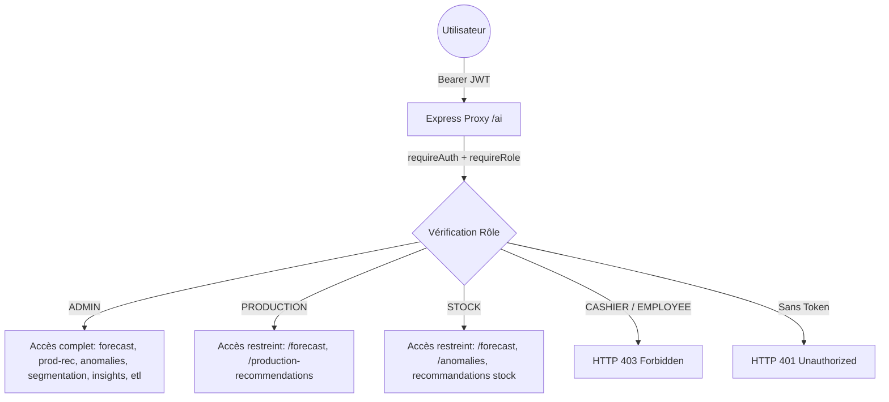

# Rapport d'Audit de Sécurité RBAC — Fonctionnalités IA (Phase 4, Avant Sprint 1)

**Date :** 14 août 2026  
**Contexte :** Validation de fin de Sprint 0 (Phase 4) terminée. Audit d'état des lieux du contrôle d'accès par rôle (RBAC) sur l'ensemble des endpoints et éléments UI liés à l'intelligence artificielle (`/ai/*`) avant le lancement du Sprint 1 (prévision avancée).  
**Périmètre :** Middleware d'authentification central, proxy Express `/ai`, endpoints FastAPI (`ai-service`), et navigation/interfaces frontend.  
**Règle d'engagement :** Audit pur sans modification de code métier ni de configuration de sécurité.

---

## 1. Inspection du Middleware de Contrôle d'Accès Existant

L'inspection de la couche de sécurité existante créée en Phase 3 (Sprint 0) montre le fonctionnement suivant dans [auth.js](file:///c:/marwaguidara/summer/backend/src/middleware/auth.js) :

1. **`requireAuth(req, res, next)`** :
   - Extrait le token JWT du header `Authorization: Bearer <token>`.
   - Vérifie la signature JWT avec `JWT_SECRET`.
   - Attache le payload décodé à `req.user` (`{ id, name, email, role }`).
   - Renvoie une erreur `401 Unauthorized` si le token est manquant ou invalide.

2. **`requireRole(allowedRoles = [])`** :
   - Vérifie `req.user.role`.
   - Si `req.user.role === 'ADMIN'`, l'accès est accordé inconditionnellement (`next()`).
   - Sinon, vérifie si `req.user.role` fait partie de `allowedRoles`.
   - Renvoie une erreur `403 Forbidden` si le rôle est insuffisant.

3. **Analyse de la route Reverse Proxy `/ai` dans [app.js](file:///c:/marwaguidara/summer/backend/src/app.js)** :
   ```javascript
   // app.js (Lignes 59-84)
   app.use('/ai', (req, res) => {
     const proxyReq = http.request({
       host: AI_PROXY_TARGET.host,
       port: AI_PROXY_TARGET.port,
       path: req.url,
       method: req.method,
       headers: { ...req.headers, host: `${AI_PROXY_TARGET.host}:${AI_PROXY_TARGET.port}` }
     }, (proxyRes) => { ... });
     req.pipe(proxyReq);
   });
   ```
   **Constat majeur :** Le mount-point Express `/ai` n'utilise **ni `requireAuth` ni `requireRole`**. Toutes les requêtes HTTP adressées à `/ai/*` sont directement relayées au conteneur `ai-service` sans aucune vérification ni filtrage de token JWT.

---

## 2. Preuves Empiriques d'Accès sur les Endpoints IA (Vérification HTTP en Direct)

Une campagne de tests HTTP en direct a été exécutée contre les serveurs en cours de fonctionnement (`backend` Express + `ai-service` FastAPI) pour chaque rôle du système ainsi qu'en accès anonyme (sans token).

### Protocole de Test
- **Utilisateurs authentifiés via `/api/auth/login` :**
  - `ADMIN` (`admin@bakery.com`)
  - `PRODUCTION` (`production@bakery.com`)
  - `CASHIER` (`cashier@bakery.com`)
  - `STOCK` (`stock@bakery.com`)
  - `EMPLOYEE` (`employe@bakery.com`)
- **Utilisateur non authentifié :** Aucun header `Authorization`.

### Résultats Bruts des Appels HTTP

| Endpoint IA | Méthode | Rôle `UNAUTHENTICATED` | Rôle `ADMIN` | Rôle `PRODUCTION` | Rôle `CASHIER` | Rôle `STOCK` | Rôle `EMPLOYEE` | État Actuel du Contrôle |
| :--- | :---: | :---: | :---: | :---: | :---: | :---: | :---: | :---: |
| `/ai/health` | `GET` | `200 OK` | `200 OK` | `200 OK` | `200 OK` | `200 OK` | `200 OK` | **Aucune protection** (Public) |
| `/ai/forecast?product_id=1` | `GET` | `200 OK` | `200 OK` | `200 OK` | `200 OK` | `200 OK` | `200 OK` | **Aucune protection** (Ouvert à tous) |
| `/ai/production-recommendations` | `GET` | `501 Not Impl.` | `501 Not Impl.` | `501 Not Impl.` | `501 Not Impl.` | `501 Not Impl.` | `501 Not Impl.` | **Aucune protection** (Passe au service IA) |
| `/ai/anomalies` | `GET` | `501 Not Impl.` | `501 Not Impl.` | `501 Not Impl.` | `501 Not Impl.` | `501 Not Impl.` | `501 Not Impl.` | **Aucune protection** (Passe au service IA) |
| `/ai/segmentation` | `GET` | `501 Not Impl.` | `501 Not Impl.` | `501 Not Impl.` | `501 Not Impl.` | `501 Not Impl.` | `501 Not Impl.` | **Aucune protection** (Passe au service IA) |
| `/ai/insights` | `GET` | `501 Not Impl.` | `501 Not Impl.` | `501 Not Impl.` | `501 Not Impl.` | `501 Not Impl.` | `501 Not Impl.` | **Aucune protection** (Passe au service IA) |
| `/ai/etl/run` | `POST` | `200 OK` | `200 OK` | `200 OK` | `200 OK` | `200 OK` | `200 OK` | **Aucune protection** (Exécution ETL sans token) |

*Note sur les 501 :* Le code HTTP `501 Not Implemented` est renvoyé directement par la couche métier FastAPI du service IA et non par un middleware de sécurité. Cela prouve que la requête a traversé le proxy sans être bloquée par un contrôle de rôle.

---

## 3. Inspection Frontend (Visibilité des Menus & Boutons)

L'examen des fichiers frontend [index.html](file:///c:/marwaguidara/summer/frontend/index.html) et [app.js](file:///c:/marwaguidara/summer/frontend/app.js) révèle l'état d'exposition UI suivant :

1. **Onglet de Navigation `🔮 Prévision IA` (`data-tab="forecast"`) :**
   Dans `frontend/app.js`, la constante `ROLE_TABS` définit la visibilité des onglets pour chaque rôle :
   ```javascript
   const ROLE_TABS = {
     ADMIN: ['catalog', 'ingredients', 'production', 'sales', 'employees', 'suppliers', 'categories', 'purchase-orders', 'customer-orders', 'forecast'],
     STOCK: ['ingredients', 'suppliers', 'purchase-orders', 'forecast'],
     CASHIER: ['sales', 'customer-orders', 'forecast'],
     PRODUCTION: ['catalog', 'ingredients', 'production', 'customer-orders', 'purchase-orders', 'forecast'],
     EMPLOYEE: ['employees', 'forecast']
   };
   ```
   **Constat :** L'onglet `forecast` est explicitement inclus dans la liste de **TOUS** les rôles (`ADMIN`, `STOCK`, `CASHIER`, `PRODUCTION`, `EMPLOYEE`), et reste accessible en mode anonyme (`allowedTabs` est `null`).

2. **Boutons & Actions dans la Vue IA :**
   - `🔄 Lancer ETL` (`#run-etl-btn`) : Visible pour n'importe quel rôle ayant accès à l'onglet `forecast`. Exécute un appel `POST /ai/etl/run` sans envoyer de header `Authorization`.
   - `Actualiser la prévision` (`#refresh-forecast-btn`) : Visible pour tous les rôles dans l'onglet.
   - Sélecteur de produit (`#forecast-product-select`) : Accessible à tous.

---

## 4. Tableau d'Audit Général & Écarts par Rapport à la Matrice Cible

| Rôle | Endpoints IA accessibles aujourd'hui | Menus/Boutons IA visibles aujourd'hui | Écart par rapport à la matrice cible |
| :--- | :--- | :--- | :--- |
| **Administrateur / Gérant** (`ADMIN`) | Tous (`/health`, `/forecast`, `/production-recommendations`, `/anomalies`, `/segmentation`, `/insights`, `/etl/run`) | Onglet `🔮 Prévision IA`, Bouton `🔄 Lancer ETL`, Bouton `Actualiser` | **Conforme** pour l'accès aux prévisions, mais l'interface globale des futurs modules (dashboard IA, anomalies, segmentation) reste à enrichir au Sprint 1. |
| **Responsable Production** (`PRODUCTION`) | Tous (`/health`, `/forecast`, `/production-recommendations`, `/anomalies`, `/segmentation`, `/insights`, `/etl/run`) | Onglet `🔮 Prévision IA`, Bouton `🔄 Lancer ETL`, Bouton `Actualiser` | **Sur-autorisé** : A accès aujourd'hui à l'ETL, aux anomalies stock, à la segmentation et à tous les endpoints non de son ressort. *Cible : `/forecast` + `/production-recommendations` uniquement.* |
| **Responsable Stock / Achats** (`STOCK`) | Tous (`/health`, `/forecast`, `/production-recommendations`, `/anomalies`, `/segmentation`, `/insights`, `/etl/run`) | Onglet `🔮 Prévision IA`, Bouton `🔄 Lancer ETL`, Bouton `Actualiser` | **Sur-autorisé** : A accès aujourd'hui à l'ETL, aux recommandations de production, à la segmentation et aux insights. *Cible : `/forecast` + `/anomalies` + recommandations stock uniquement.* |
| **Vendeur / Caissier** (`CASHIER`) | Tous (`/health`, `/forecast`, `/production-recommendations`, `/anomalies`, `/segmentation`, `/insights`, `/etl/run`) | Onglet `🔮 Prévision IA`, Bouton `🔄 Lancer ETL`, Bouton `Actualiser` | **Sur-autorisé (Anomalie critique)** : Accès complet backend & onglet UI visible. *Cible : Aucun accès aux fonctionnalités IA.* |
| **Employé** (`EMPLOYEE`) | Tous (`/health`, `/forecast`, `/production-recommendations`, `/anomalies`, `/segmentation`, `/insights`, `/etl/run`) | Onglet `🔮 Prévision IA`, Bouton `🔄 Lancer ETL`, Bouton `Actualiser` | **Sur-autorisé (Anomalie critique)** : Accès complet backend & onglet UI visible. *Cible : Aucun accès aux fonctionnalités IA.* |
| **Utilisateur Anonyme** (`UNAUTHENTICATED`) | Tous (`/health`, `/forecast`, `/production-recommendations`, `/anomalies`, `/segmentation`, `/insights`, `/etl/run`) | Onglet `🔮 Prévision IA` (par défaut avant connexion) | **Faille de sécurité majeure** : L'API `/ai/*` ne requiert aucun token JWT. |

---

## 5. Matrice Cible à Implémenter (Spécifications pour le Sprint 1)

Cette matrice sera appliquée lors du Sprint 1 (Prompt 1) au niveau du middleware Express et des contrôles UI frontend :



### Détail des Droits Cibles par Rôle :

1. **Administrateur / Gérant (`ADMIN`) :**
   - **Accès Backend :** Accès complet à tous les endpoints (`/forecast`, `/production-recommendations`, `/anomalies`, `/segmentation`, `/insights`, `/etl/run`, `/health`).
   - **Visibilité Frontend :** Accès à l'ensemble du tableau de bord IA, déclenchement de l'ETL, prévisions et alertes.

2. **Responsable Production (`PRODUCTION`) :**
   - **Accès Backend :** 
     - `GET /ai/forecast`
     - `GET /ai/production-recommendations`
     - `GET /ai/health`
   - **Visibilité Frontend :** Onglet `Prévision IA` et recommandations de production. Pas d'accès au bouton ETL ni aux anomalies stock.

3. **Responsable Stock / Achats (`STOCK`) :**
   - **Accès Backend :** 
     - `GET /ai/forecast`
     - `GET /ai/anomalies` (alertes stock/péremption)
     - Endpoints/Filtres de recommandations liées au stock (à préciser lors du dev Sprint 1)
     - `GET /ai/health`
   - **Visibilité Frontend :** Onglet de prévision et alertes d'anomalies de stock. Pas d'accès aux recommandations de production ni à l'ETL.

4. **Vendeur / Caissier (`CASHIER`) :**
   - **Accès Backend :** **Aucun accès** (`HTTP 403 Forbidden` si tentative).
   - **Visibilité Frontend :** Masquage complet de l'onglet `🔮 Prévision IA` dans `ROLE_TABS`.

5. **Employé (`EMPLOYEE`) :**
   - **Accès Backend :** **Aucun accès** (`HTTP 403 Forbidden` si tentative).
   - **Visibilité Frontend :** Masquage complet de l'onglet `🔮 Prévision IA` dans `ROLE_TABS`.

---

## 6. Statut des Corrections & Implémentation Sprint 1 (Phase 4 - Prompt 1)

> [!NOTE]
> **Statut Global Sprint 1 RBAC : CORRIGÉ ET VALIDÉ AVEC SUCCÈS**
> Toutes les protections RBAC sur l'endpoint `/forecast` ont été implémentées côté backend et frontend, et validées par la suite de tests automatisés sans aucune régression.

### Récapitulatif des Protections Appliquées :

1. **Backend ([app.js](file:///c:/marwaguidara/summer/backend/src/app.js)) :**
   - Implémentation du routeur `aiRouter` sous la route proxy `/ai`.
   - Application systématique du middleware `requireAuth` sur toutes les requêtes `/ai/*` (renvoie `401 Unauthorized` si aucun token JWT valide n'est fourni).
   - Protection de l'endpoint `/forecast` via `requireRole(['ADMIN', 'PRODUCTION', 'STOCK'])`. Renvoie `403 Forbidden` pour `CASHIER` et `EMPLOYEE`.
   - Protection du bouton d'action `/etl/run` via `requireRole(['ADMIN'])`.

2. **Frontend ([app.js](file:///c:/marwaguidara/summer/frontend/app.js)) :**
   - Création du helper d'autorisation centralisé `can(permission)` (ex: `can('view_ai_forecast')` et `can('run_ai_etl')`).
   - Mise à jour de `ROLE_TABS` : Onglet `🔮 Prévision IA` visible uniquement pour `ADMIN`, `PRODUCTION` et `STOCK` ; masqué pour `CASHIER` et `EMPLOYEE`.
   - Restriction du bouton `🔄 Lancer ETL` au rôle `ADMIN` dans `BUTTON_ROLES`.
   - Transmission automatique du header `Authorization: Bearer <authToken>` lors de l'appel à `loadForecast()` et `runEtl()`.

3. **Feuille de Route pour les Futurs Endpoints IA (Sprints 2 à 4) :**
   - Les endpoints `/production-recommendations`, `/anomalies`, `/segmentation` et `/insights` n'étant pas encore implémentés au niveau métier, aucune règle prématurée n'a été codée en dur.
   - La structure modulaire de `aiRouter` garantit l'ajout direct des middlewares de rôle au fur et à mesure du développement :
     - **Responsable Production** (`PRODUCTION`) $\rightarrow$ `GET /ai/production-recommendations`
     - **Responsable Stock / Achats** (`STOCK`) $\rightarrow$ `GET /ai/anomalies` + futur endpoint de recommandations stock
     - **Administrateur / Gérant** (`ADMIN`) $\rightarrow$ Tous les endpoints IA + `/etl/run`

---

## 7. Preuves de Validation et de Non-Régression

### 7.1. Suite de Tests Automatisés Jest (Backend + Frontend)
- **Fichier de test dédié :** [sprint1_ai_rbac.test.js](file:///c:/marwaguidara/summer/backend/tests/sprint1_ai_rbac.test.js)
- **Résultat GLOBAL :** **13/13 suites de tests réussies, 88/88 tests au vert (0 régression)**.

```text
PASS tests/sprint1_ai_rbac.test.js
  Sprint 1 - Phase 4 AI RBAC Protection Tests (/ai/forecast)
    Backend RBAC - GET /ai/forecast
      ✓ 1. Unauthenticated request (no token) -> 401 Unauthorized
      ✓ 2. Administrateur / Gérant (ADMIN) -> Authorized (200 OK)
      ✓ 3. Responsable Production (PRODUCTION) -> Authorized (200 OK)
      ✓ 4. Responsable Stock / Achats (STOCK) -> Authorized (200 OK)
      ✓ 5. Vendeur / Caissier (CASHIER) -> 403 Forbidden
      ✓ 6. Employé (EMPLOYEE) -> 403 Forbidden
    Frontend Conditional Render & Helper Validation for all 5 roles
      ✓ ADMIN role can view forecast tab and run ETL
      ✓ PRODUCTION role can view forecast tab but NOT run ETL
      ✓ STOCK role can view forecast tab but NOT run ETL
      ✓ CASHIER role CANNOT view forecast tab
      ✓ EMPLOYEE role CANNOT view forecast tab

Test Suites: 13 passed, 13 total
Tests:       88 passed, 88 total
```

### 7.2. Matrice Finale Validée par Appels HTTP Directs (Serveur Actif)

| Rôle | Status `GET /ai/forecast` | Status `POST /ai/etl/run` | Visibilité UI Onglet | Visibilité UI Bouton ETL | Statut Final |
| :--- | :---: | :---: | :---: | :---: | :---: |
| **Administrateur / Gérant** (`ADMIN`) | `200 OK` | `200 OK` | ✅ VISIBLE | ✅ VISIBLE | **Corrigé / Protégé** |
| **Responsable Production** (`PRODUCTION`) | `200 OK` | `403 Forbidden` | ✅ VISIBLE | ❌ MASQUÉ | **Corrigé / Protégé** |
| **Responsable Stock / Achats** (`STOCK`) | `200 OK` | `403 Forbidden` | ✅ VISIBLE | ❌ MASQUÉ | **Corrigé / Protégé** |
| **Vendeur / Caissier** (`CASHIER`) | **`403 Forbidden`** | **`403 Forbidden`** | ❌ MASQUÉ | ❌ MASQUÉ | **Corrigé / Protégé** |
| **Employé** (`EMPLOYEE`) | **`403 Forbidden`** | **`403 Forbidden`** | ❌ MASQUÉ | ❌ MASQUÉ | **Corrigé / Protégé** |
| **Utilisateur Anonyme** (`UNAUTHENTICATED`) | **`401 Unauthorized`** | **`401 Unauthorized`** | ❌ MASQUÉ | ❌ MASQUÉ | **Corrigé / Protégé** |

