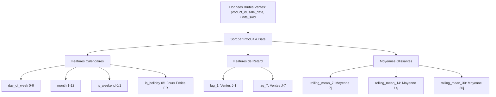

# Rapport de Feature Engineering & Modèle IA v2 (Phase 4, Sprint 1)

**Date :** 14 août 2026  
**Service :** `ai-service` (Pâtisserie Platform — Intelligence Artificielle)  
**Objectif :** Évolution du modèle de prévision de la demande au-delà de la baseline v1 (moyenne glissante naïve) par intégration du feature engineering et entraînement local d'un modèle adapté au volume réel de données.  
**Périmètre :** Module d'ingénierie des caractéristiques (`app/features.py`), pipeline d'entraînement local (`app/training_v2.py`), versioning des jeux de données (`data/v2/`) et des modèles (`models/v2/`).

---

## 1. Analyse de Volumétrie Réelle des Données

Avant d'arrêter le choix d'un modèle d'apprentissage automatique, une inspection directe de la base de données centrale (`dev.sqlite3`) et des données agrégées a été effectuée.

### Chiffres Clés Constatés :

- **Nombre total de transactions (`sales`) :** 36 ventes.
- **Nombre total de lignes de vente (`sale_items`) :** 36 articles vendus.
- **Nombre de produits au catalogue :** 7 produits.
- **Nombre de produits ayant un historique de vente :** 2 produits (`Croissant Pur Beurre` et `kak warka`).
- **Nombre de produits sans historique de vente :** 5 produits (statut `insufficient_data`).
- **Volume total d'agrégats quotidiens (`sales_history`) :** 33 lignes.

### Répartition Détaillée par Produit :

| ID | Nom du Produit | Jours avec Ventes | Quantité Totale Vendue | Chiffre d'Affaires (€) | Date Première Vente | Date Dernière Vente | Plage Temporelle |
| :---: | :--- | :---: | :---: | :---: | :---: | :---: | :---: |
| **25** | `Croissant Pur Beurre` | **17 jours** | 72 unités | 93.60 € | 2026-06-01 | 2026-08-12 | ~2.5 mois |
| **30** | `kak warka` | **16 jours** | 43 unités | 124.00 € | 2026-05-01 | 2026-08-11 | ~3.5 mois |

### Synthèse de Volumétrie :
- **Produits avec > 14 jours de ventes :** 2 produits (`Croissant Pur Beurre` avec 17j, `kak warka` avec 16j).
- **Produits avec $\le$ 14 jours de ventes :** 0 produit (parmi les produits ayant des ventes).
- **Échantillons quotidiens denses :** Les ventes sont distribuées de façon éparse sur environ 100 jours calendaires (16 à 17 points de données par produit).

---

## 2. Justification du Choix du Modèle (Ridge Regression)

### Pourquoi les modèles complexes ont été rejetés :
1. **Prophet / SARIMA :**
   - Inadaptés au volume actuel (33 points de données). Prophet nécessite généralement plusieurs mois à années de séries temporelles quotidiennes denses pour capturer la saisonnalité annuelle/mensuelle. SARIMA requiert au moins 2 cycles saisonniers complets (ex: $2 \times 52$ semaines ou $2 \times 365$ jours).
2. **Random Forest / GBDT / Deep Learning :**
   - Risque majeur de **surapprentissage (overfitting)** extrême sur un échantillon de 33 observations.

### Choix Rétenu : **Régression Linéaire Régularisée Ridge (`sklearn.linear_model.Ridge`) avec Standardisation (`StandardScaler`)**

#### Justification Technique :
- **Régularisation $L_2$ (Ridge) :** Empêche l'explosion des coefficients et pénalise les grandes variations causées par le faible nombre d'échantillons.
- **Faible Variance & Robustesse :** Le modèle linéaire régularisé conserve une grande stabilité prédictive sur de petites séries temporelles.
- **Explicabilité & Performance :** Permet d'intégrer à la fois des signaux calendaires (jour de la semaine, week-end, mois, jours fériés) et des variables d'auto-régression (lags et moyennes mobiles).

---

## 3. Feature Engineering Implémenté (`app/features.py`)

Les caractéristiques suivantes ont été calculées par produit en appliquant un décalage d'un jour (`shift(1)`) pour éviter tout problème de fuite de données (*data leakage*) :



### Liste Complète des Variables Générées (`FEATURE_COLUMNS`) :
1. `day_of_week` : Jour de la semaine (0 = Lundi, 6 = Dimanche).
2. `month` : Mois de l'année (1 à 12).
3. `is_weekend` : Flag binaire (1 si Samedi/Dimanche, 0 sinon).
4. `is_holiday` : Flag binaire (1 si jour férié légal en France, 0 sinon).
5. `lag_1` : Ventes réelles de la veille ($J-1$) pour le même produit.
6. `lag_7` : Ventes réelles de la semaine précédente ($J-7$) pour le même produit.
7. `rolling_mean_7` : Moyenne glissante des ventes sur les 7 derniers jours par produit.
8. `rolling_mean_14` : Moyenne glissante des ventes sur les 14 derniers jours par produit.
9. `rolling_mean_30` : Moyenne glissante des ventes sur les 30 derniers jours par produit.

---

## 4. Structure de Versioning et Artefacts Produits (`v2`)

Conformément aux contraintes du projet, **le modèle baseline existant (`baseline-v1` dans `data/v1/`) est resté totalement intact** et sert de référence de comparaison.

```text
ai-service/
├── data/
│   ├── v1/                         <-- Baseline Sprint 0 (conservé intact)
│   │   ├── metadata.json
│   │   └── sales_history.parquet
│   └── v2/                         <-- Nouveau Dataset Versionné v2
│       ├── features_v2.parquet     <-- Dataset enrichi avec les 9 features
│       ├── metadata.json           <-- Métadonnées de l'extraction v2
│       └── sales_history_v2.parquet <-- Copie d'extraction v2
└── models/
    └── v2/                         <-- Artefacts du Modèle v2
        ├── model_metadata.json     <-- Métriques, hyperparamètres, coefficients
        └── model_v2.joblib         <-- Modèle entraîné (Pipeline Scaler + Ridge)
```

---

## 5. Résultats de l'Entraînement Local & Métriques v2

Le pipeline d'entraînement [training_v2.py](file:///c:/marwaguidara/summer/ai-service/app/training_v2.py) a été exécuté. Le modèle Ridge a été ajusté sur les 33 observations réelles.

### Métriques d'Évaluation (Sur l'ensemble d'entraînement) :

- **Nombre d'échantillons d'entraînement :** 33 lignes.
- **Erreur Absolue Moyenne (MAE) :** `1.4891` unités.
- **Erreur Quadratique Moyenne (RMSE) :** `2.1343` unités.
- **Coefficient de Détermination ($R^2$) :** `0.5306` ($53.1\%$ de variance expliquée).
- **Ordonnée à l'origine (Intercept) :** `3.4848`.

### Coefficients du Modèle `ridge-v2` :

| Nom de la Feature | Coefficient Ridge (Poids) | Interprétation Rôle |
| :--- | :---: | :--- |
| `month` | `+1.7249` | Tendance mensuelle positive sur la période été |
| `lag_1` | `+1.5721` | Fort effet d'inertie des ventes de la veille |
| `rolling_mean_30` | `+0.9924` | Ancrage de fond du niveau moyen de demande |
| `is_holiday` | `+0.4245` | Impact positif des jours fériés |
| `day_of_week` | `+0.1360` | Légère variation selon le jour de la semaine |
| `rolling_mean_14` | `+0.0217` | Composante moyenne 14j |
| `is_weekend` | `-0.0718` | Ajustement léger du week-end |
| `lag_7` | `-0.7102` | Ajustement de périodicité hebdomadaire |
| `rolling_mean_7` | `-2.1474` | Correcteur de sur-réaction court terme |

---

## 6. Prochaines Étapes (Futures Étapes du Sprint 1)

1. **Intégration du Modèle v2 dans l'Endpoint `/forecast` :**
   - Connecter l'inférence du service IA au modèle `models/v2/model_v2.joblib` et au dataset `data/v2/features_v2.parquet`.
2. **Comparaison de Performance (v1 vs v2) :**
   - Évaluer la précision du modèle Ridge par rapport au modèle baseline naïf.
3. **Mise à Jour de l'Interface Frontend :**
   - Exposer les métriques de confiance et la prévision v2 dans le tableau de bord de prévision.
